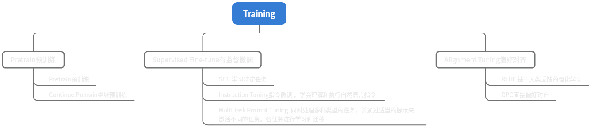

# LearnVLM

# 大模型基础知识

[基础知识](基础知识.md)

# 最新工作

## 图文理解

|                                                              | 时间    | 说明                                                | 机构          |
| ------------------------------------------------------------ | ------- | --------------------------------------------------- | ------------- |
| [DeepSeek-VL2](https://mp.weixin.qq.com/s?__biz=Mzk0OTYwNzc3NQ==&mid=2247485379&idx=1&sn=3a1733c7ed2b0231cb13082c7146d7a0&chksm=c236513d5e276fad5d94aa86ce2519d2d43f0441826bc777a7952633a5f7337dc4556c94113a&mpshare=1&scene=1&srcid=1213jHuDL1YgQA0xRAF74jer&sharer_shareinfo=aa453c1d03e827f69197fcf6bdbff07f&sharer_shareinfo_first=aa453c1d03e827f69197fcf6bdbff07f#rd) | 2024.12 | MoE 架构 + 动态切图（3B~27B）                       | DeepSeek      |
| [InternVL2.5](https://mp.weixin.qq.com/s?__biz=Mzg5NDc0MTUxMA==&mid=2247533969&idx=1&sn=a525605e87e2ea1a81dcf2b2fca05ebf&chksm=c1bd6440fa249fbc826c5925fcd11b8632045de89f27e66be7448e59d9d1dad07ab61689edeb&mpshare=1&scene=1&srcid=12124AqvFmepP3jQdgVLdzIf&sharer_shareinfo=9109bf744e64e75a3b8ca05f38045e51&sharer_shareinfo_first=86b94808bde0d49cd49a9ba8c433b83f#rd) | 2024.12 | 全量级开源多模态性能第一(1B~78B)，思维链与推理扩展  | 上海AI Lab    |
| [Megrez-3B-Omni](https://mp.weixin.qq.com/s?__biz=MzIzNjc1NzUzMw==&mid=2247767099&idx=1&sn=95ccd4377069c8ea9e5dffc20ff8911c&chksm=e9c8e732da2c8e26d952c2f4f145ea32d0ace44542c74f3b8ba73338d77e422ac6a2e6c9d2e6&mpshare=1&scene=1&srcid=1216xBbylLCNt9V3kK4Z8p0i&sharer_shareinfo=06e2a69ba86a223c5d7d6b98a50a5dcb&sharer_shareinfo_first=06e2a69ba86a223c5d7d6b98a50a5dcb#rd) | 2024.12 | 3B端侧全模态                                        | 无问芯穹      |
| [FocusLLaVA](https://mp.weixin.qq.com/s?__biz=Mzk0NTY1Mjg5NQ==&mid=2247486155&idx=1&sn=32fbc9832df14339f72da34850341a13&chksm=c2ac0c82dbbed4a4d3c172d4493122f5525ede3b1c4a7e7bf02090f6c19bd388fd3ccd5acfed&mpshare=1&scene=1&srcid=1130ikpCZHrotsxPDabcuVPy&sharer_shareinfo=4c2e86cbe741416470bf98a48e3db7dd&sharer_shareinfo_first=4c2e86cbe741416470bf98a48e3db7dd#rd) | 2024.11 | 压缩视觉Token                                       | 同济&蚂蚁金服 |
| [MME-Survey](https://arxiv.org/abs/2411.15296)               | 2024.11 | VLM最全评测综述                                     |               |
| [GLM-Edge](https://github.com/THUDM/GLM-Edge)                | 2024.11 | 2B端侧VLM                                           | 智谱          |
| [SmolVLM](https://huggingface.co/blog/smolvlm)               | 2024.11 | 2B端侧VLM                                           | huggingface   |
| [LLaVA-o1](https://mp.weixin.qq.com/s?__biz=MzkxNTI4NTA1OA==&mid=2247484353&idx=1&sn=dde8969df08d4d7773eaf504f7600c01&chksm=c02e7ca7a12db4c8631cd740d9ed90e8de394fb63ef7f07d7f6981b40b7305871d7b7f555383&mpshare=1&scene=1&srcid=1119L5wXPGQY5LcqUYacjDzk&sharer_shareinfo=371e7b3eebbbaae2c961787eec3ac240&sharer_shareinfo_first=371e7b3eebbbaae2c961787eec3ac240#rd) | 2024.11 | 类似OpenAI的o1的自主多阶段推理                      | 清华          |
| BlueLM-V-3B                                                  | 2024.11 | 3B端侧VLM                                           | vivo & MMLab  |
| [YOPO](https://mp.weixin.qq.com/s?__biz=MzI5MDUyMDIxNA==&mid=2247701049&idx=1&sn=715a76523af7f5e731e8456370a5483d&chksm=edd7523664cef7fa051b0c0cbf41fca6903abc02439904ad9795dd38afc34506150dff37e774&mpshare=1&scene=1&srcid=1202JTRZpTEmGWh8epv08meM&sharer_shareinfo=cb155e96646d410c969f830a27047490&sharer_shareinfo_first=cb155e96646d410c969f830a27047490#rd) | 2024.10 | LLaVA剪枝，大幅缩减计算量至12%                      | Adobe         |
| [TextHawk2](https://mp.weixin.qq.com/s?__biz=Mzk0NTY1Mjg5NQ==&mid=2247485123&idx=1&sn=b7e3af063ed9ad1d9753c9538d4ef4e9&chksm=c2420368d85e7cd6851f440f51482e6189839f791a19ac1124385a48f0b00a38f1d3317de361&mpshare=1&scene=1&srcid=1017P48hwmr4JOw37w9jaLTa&sharer_shareinfo=1cb157531fbcd41b375452171db5e5a0&sharer_shareinfo_first=1cb157531fbcd41b375452171db5e5a0#rd) | 2024.10 | 压缩视觉token，不损害细粒度感知能力，适用文档理解。 | 华为          |
| [LOVA3](https://mp.weixin.qq.com/s?__biz=Mzg5Nzk0MDg1MA==&mid=2247484938&idx=1&sn=06e36c14419bf07278ca09e7a11394f9&chksm=c170fc47ce84086bc7ef5356405150eca2fa224bb0df856d4ff3688ebf4291538640e4445532&mpshare=1&scene=1&srcid=1102dvNvd0VR9ERl96JVoePM&sharer_shareinfo=246d54b78fc3c697a506584389bb3da2&sharer_shareinfo_first=246d54b78fc3c697a506584389bb3da2#rd) | 2024.5  | 让MLLM学会提出问题并评估                            |               |

## 视频理解

|                                                              | 时间    | 说明                                                       | 机构              |
| ------------------------------------------------------------ | ------- | ---------------------------------------------------------- | ----------------- |
| [PP-LLaVA](https://mp.weixin.qq.com/s?__biz=Mzk0NTY1Mjg5NQ==&mid=2247485864&idx=1&sn=a6c649d57be74f69dca7d73b42a66f76&chksm=c29e3f61678f50b017d29c3da365f28b9e803ef313866ce30286ecbd72936abb426e69f63d87&mpshare=1&scene=1&srcid=1115acs9Xde5vS9VAoPn69UH&sharer_shareinfo=7b82ae92bfe555621b3a2e8085b9003d&sharer_shareinfo_first=7b82ae92bfe555621b3a2e8085b9003d#rd) | 2024.10 | 同时应对短视频和长视频的理解                               | 腾讯 & 鹏城实验室 |
| [InternVid](https://zhuanlan.zhihu.com/p/929138634?utm_medium=social&utm_psn=1828399568867450881&utm_source=wechat_session) | 2023.7  | 多模态视频理解与生成的大规模视频-文本数据集 ICLR Spotlight |                   |

## LLM

- [LLM相关知识](https://github.com/wdndev/llm_interview_note?tab=readme-ov-file)
