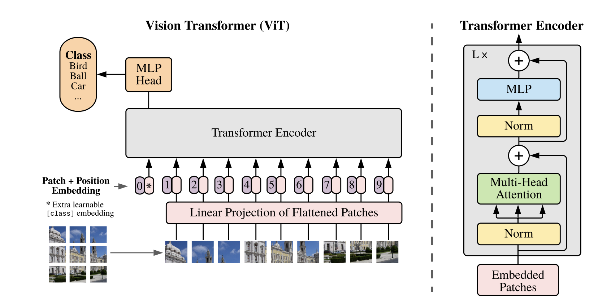
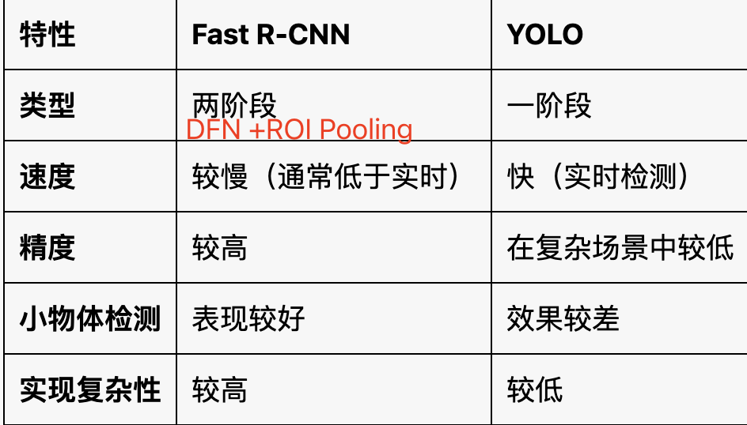
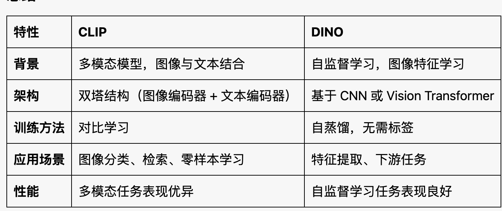
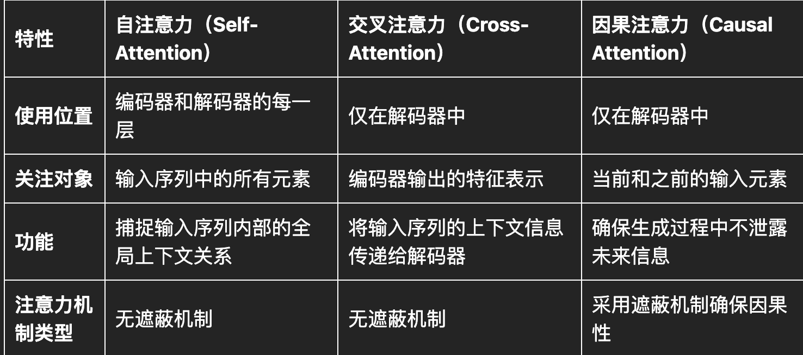
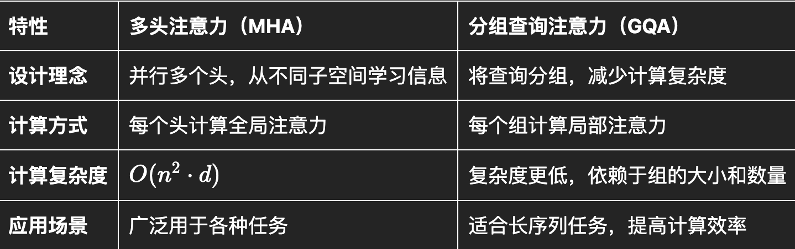
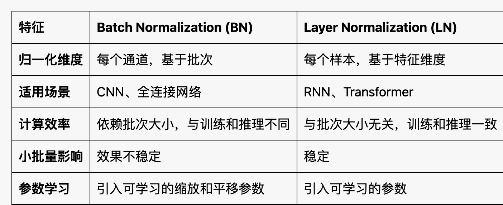
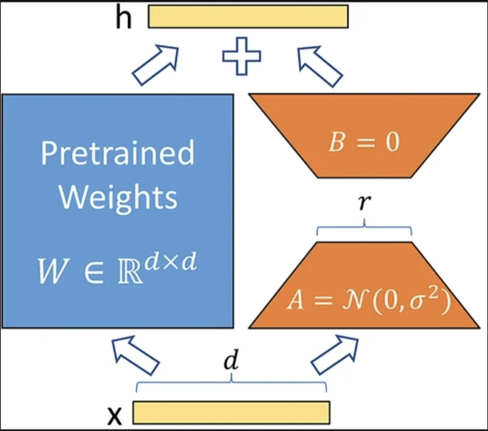
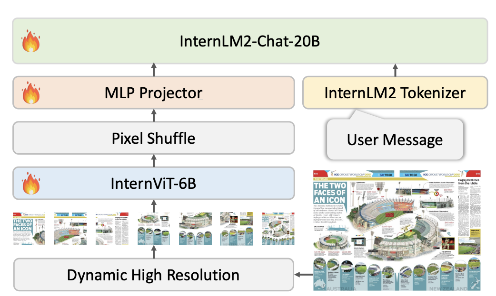
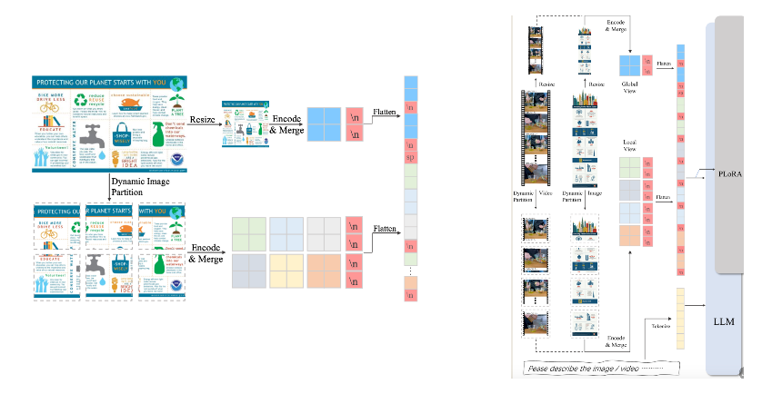

## 一、CV

### 1. 基础
xxx

### 2. Backbone

#### 1. Vision Transformer

##### (1)简述ViT模型架构

[ViT论文解读](https://mp.weixin.qq.com/s?__biz=MzI5MDUyMDIxNA==&mid=2247696191&idx=1&sn=06fdf65d2e18b39094790b32d6f6dd86&chksm=ed1b5b85b03feae35eae006692469a0a45ac2c1c4920db3a8d37c93f65e9a1c10558e3ea2f8f&mpshare=1&scene=1&srcid=0929BVl3nYuv8l6hX9OHWOiz&sharer_shareinfo=a8499c4f16f014316f5ddb56421c3eab&sharer_shareinfo_first=a8499c4f16f014316f5ddb56421c3eab#rd)

图像切成patch,生成PatchEmbedding--> 扩展ClassEmbedding--> Position Embedding位置嵌入->TransformerEncoder->MLP Head

##### (2) 相比CNN，ViT 优缺点 

优势

- 全局建模能力强：利用自注意力机制，直接捕捉图像的全局特征和长距离依赖关系。
- 多模态适用性强：各模态架构统一，方便多模态任务中迁移和融合

缺点

- 数据需求量大： ViT缺乏CNN的归纳偏置，需要更多的数据来自动学习到空间不变性等假设。

- 计算成本高、训练难度大： 自注意力机制的计算复杂度较高。

### 3. 目标检测

1. FasterR-CNN 和 Yolo区别、优缺点

   Yolo 端到端，SxS 网格，每个网格预测固定数量的边界框和类别概率。速度快，但精度略低。 FasterR-CNN：区域生成、特征提取、分类和回归。 小物体和密集场景精度高，但速度慢 

   

2. 相比Yolov5，YoloV8优化点

   数据增强部分:参考YoloX,最后 10 epoch 关闭 Mosiac 增强的操作，有效地提升精度 结构部分：将 YOLOv5 的 C3 结构换成了梯度流更丰富的 C2f 结构， 更多的跳层连接和额外的 Split  Loss 部分：分类分支依然采用 BCE Loss   回归分支采用 Distribution Focal Loss Head 部分: （1）解耦头结构，将分类和检测头分离 （2）ancher free

3. Mosaic数据增强 是什么，优势

   主要思想是将四张图片进行随机裁剪，再拼接到一张图上。

   优势（1）丰富背景，增加数据集的多样性和复杂性 （2）提升小物体检测（3）平衡类分布 （4）提升模型稳定性

### 4. 对比学习

#### 1. CLIP架构

模型结构： 图像编码器 + 文本编码器，通过对比学习，使得匹配的图像-文本对的特征向量尽可能接近，而不匹配的图像-文本对的特征向量尽可能远离。将图片文本对齐到同一特征空间

#### 2. 对比学习常用的损失函数有哪些？

#### 3. CLIP和DINO区别

## 二、Transformer

### 1. BERT 和GPT区别？

（1）BERT：Encoder-Only模型，目标是通过双向上下文理解，捕捉词语的深层语义。擅长理解任务。

（2）GPT： Decoder-Only 模型，目标是采用自回归的训练方式持续预测下一个词语 。擅长生成任务。

### 2.  Encoder和Decoder区别?

1. Encoder：利用自注意力机制和前馈神经网络的结构，主要负责将输入编码为高层语义特征。
2. Decoder：额外使用编码器解码器注意力机制，主要负责将高层语义特征解码，持续预测下一个词，完成序列生成任务。

### 3. 三个Attention作用和区别?   

### 4.  多头自注意力  

#### （1）多头自注意力作用

1.  每个注意力头可以**关注不同的子空间**，捕捉更丰富的语义信息，增强模型表达能力。
2.  **平衡注意力分布**、提高模型的训练效果。

#### （2）mask为啥要加很小数?

通过softmax让其输出的注意力权重接近 0，目的是屏蔽不需要计算注意力的某些位置

#### （3） 为什么要除以根号d?

1. 规范化，防止softmax计算时值过大，导致梯度消失或训练不稳定。
2. 更平滑地分配注意力权重，加速模型收敛。

#### （4）多头注意力MHA  和 分组查询注意力GQA区别

### 5. 如何防止梯度消失？

1. 残差连接：自注意力和前馈层 使用 
2. 层归一化LayerNorm 
3. 缩放点积注意力： 对点积结果进行缩放，防止度），防止点积值过大，避免softmax计算引发梯度爆炸 
4. Dropout、激活函数GELU

### 6. BN和LN的区别？

### 7. 位置编码

#### （1）位置编码的作用

自注意力机制本身并行运算，不具备处理序列顺序的能力，需要每个输入元素提供其在序列中的位置，从而帮助模型理解元素之间的相对和绝对位置关系。

#### （2）位置编码类型

[links](http://xhslink.com/a/eyexmRriq9G2)

|                  | 作用                                                         | 适用场景 |
| ---------------- | ------------------------------------------------------------ | -------- |
| 绝对位置编码     | 记录==具体位置==                                             | 短文本   |
| 相对位置编码     | 捕捉前后关系 （不仅具体位置，还有==前后关系==）              | 长度灵活 |
| 旋转位置编码RoPE | 增强长距离理解（“角度感知”不仅前后关系，还知道==距离多远==） | 长文本   |

## 三、大模型

### 1. 大模型有哪些微调方法？

（1）全参微调/冻结部分层：只放开Proj层、Proj+LLM等

（2）参数高效微调PEFT

- Prompt-Tuning（P-Tuning） ：通过添加额外的任务特定参数来引导预模型的行为。
- Adapter-tuning：通过插入小的适配器模块来进行微调，这些适配器模块仅需少量的可训练参数，适用于多任务学习。
- LoRA： 注入可训练的低秩分解矩阵   
-  QLoRA：对低秩矩阵量化

### 2. LoRA优势、参数如何初始化、有哪些配置参数？

（1）优势：（1）降低训练成本（2）保持原始模型完整性

（2）参数如何初始化？

- 矩阵 A：使用正态分布随机初始化

- 矩阵B ：全0初始化

  目的：（1）避免梯度消失（2）控制初始偏移量，避免引入噪声

（3）LoRA参数

- r 低秩矩阵的秩。 `d*d` 分解为`d*r`  `r*d`，取值范围4~**64**之间
- lora_alpha 缩放因子，控制权重更新幅度，平衡学习效率和模型收敛度。
- lora_dropout 丢失概率，防止过拟合。取值范围<0.1

$$
W{\prime} = W + \frac{\alpha}{r} A B
$$

### 3. 如何让大模型推理输出更模糊？

1. 调节温度：控制概率分布的平滑度

   原理：控制softmax函数中的温度参数，改变模型输出的概率分布的平滑度。温度越高，越平滑。

2. Top-k采样：控制选择的候选词数量

   原理：在每次选择下一个词时，模型会根据概率分布选出前k个最可能的词，然后从这k个词中随机选择一个作为输出。增加随机性

3. Top-p采样：根据概率分布的累积阈值进行采样

   原理：设定一个累积概率阈值p，模型将从概率分布中选出最小的一组词，使得这些词的累积概率和大于p。这使得采样过程中，选择的词可能性较高，但同时也允许较低概率的词有机会被选中。

4. 多次采样、随机选择

5. 注入噪声：在输入或隐藏状态中注入噪声

### 4. 如何理解大模型的困惑度PPL？

- 作用：衡量对文本的预测不确定性，反映模型的理解能力
- 公式：类似交叉熵

### 5. 如何解决训练loss异常？

1. 数据
   - 问题1：可能存在噪声、异常值、标签错误等      解决：数据清洗，去除异常值或修正标签
   - 问题2：数据不平衡    解决：丰富数据、数据增强
2. 训练参数
   - 问题1：学习率过高、batch过小等导致 loss震荡      解决：调整参数
   - 问题2：梯度爆炸/梯度消失      解决：梯度裁剪等
3. 硬件差异
   - 相同参数和配置下，比如L40s训练无法复现A800结果，低2个点

### 6. 如何分布式训练？

- 并行方案  DP(数据并行)、TP(张量并行)、PP(流水线并行)等

- DeepSpeed ZeRO123

  - ZeRO-1：优化器状态分片
  - ZeRO-2：优化器状态分片+梯度分片
  - ZeRO-3：优化器状态分片+梯度分片+模型参数分片

  

### 7. VLM模型架构

#### （1）LLaVA

1. 目前有哪些桥接结构？ Qformer、MLP

2. BLIP2和LLava的区别

   |          | BLIP2                                                        | LLaVA                                                        |
   | -------- | ------------------------------------------------------------ | ------------------------------------------------------------ |
   | 桥接结构 | Q-former                                                     | 线性投影层                                                   |
   | 训练方式 | •	阶段1：训练Q-former •	阶段2：。。。             | •	阶段1：训proj，对齐模态 •	阶段2：微调LLM        |
   | 损失函数 | •	图像-文本对比损失（ITC）：用于对比图像和文本的相似性。 •	图像-文本匹配损失（ITM）： 用于判断图像和文本是否匹配。 •	语言建模损失（LM）：用于训练语言模型的生成能力。 使用Bootstrapping策略进行训练，并结合多种损失函数进行联合训练 | •	语言建模损失（LM）：用于训练语言模型的生成能力。 通过简单的线性投影层连接视觉和语言模型，并采用指令微调策略进行训练 |

#### （2）LLaVA-1.5    

- 数据：扩充了更多VQA OCR数据，增强图像理解能力

-  模型：（1）CLIP_ViT分辨率从224到336 （2）Proj 用多层感知机(Linear->Gelu->Linear)，代替单层线性层

#### （3）LLaVA-1.6(LLaVA-NeXT)

背景：受限原始ViT大小，无法对文档等细粒度内容理解、同时容易存在幻觉

改进

1. 通过长宽比网格，实现4倍**更高分辨率**，保留更多视觉细节，减少幻觉   1:1 2:2  1:3  3:1

2. 通过构建**高精指令数据**，实现更好的推理和OCR能力、更丰富的世界知识

3. 支持**SGLang**高效部署

#### （4）InternVL1.5  

- 背景：受限原始ViT大小，无法对文档等细粒度内容理解、同时容易存在幻觉

- 方案：   **AnyRes**+**PixcelShuffle**，输入分辨率扩充到4k。

#### （5）Mini-Monkey

背景：切分策略引起的“锯齿效应“，限制了对细节场景的理解能力，尤其对文档理解任务。

方案：

- **多尺度自适应裁剪策略**（MSAC），即在不同尺度上捕捉图像特征，有效避免了因裁剪导致的信息丢失。类似图像金字塔。
- 三层特征包含详细层（提供详细信息） + 适应层（与详细层切分不重叠，提供多尺度的对象特征） + 全局层（缩略图，提供全局信息）

#### （6）InternLM-XComposer

​	整体上PixcelShuffle之后视觉token添加特殊字符标记**位置关系**

- InternLM-XComposer2-4KHD    仅保留行信息
- InternLM-XComposer-2.5          保留完整2D空间关系

#### （7）Qwen2-VL

1. **原生动态分辨率**：处理任意分辨率的图像，对应动态数量的视觉tokens，提升了视觉表示。
2. **多模态旋转位置嵌入（M-RoPE）**：将传统的旋转位置编码分解为时间、高度和宽度三个部分，使得模型能够同时捕捉和整合一维文本、二维视觉和三维视频的位置信息，增强了多模态数据处理能力。
3. 统一图像视频：支持超过20分钟的长视频理解能力   

4. 视觉智能体能力Agent

5. 多语言支持

[Qwen2-VL 模型结构解析](https://zhuanlan.zhihu.com/p/717884243)✅