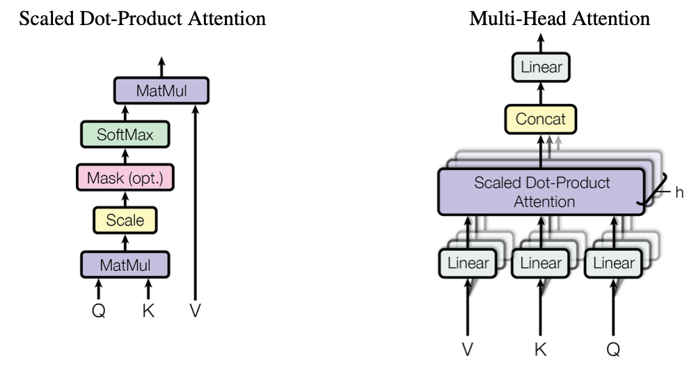

# 基础语法

- 矩阵乘法： @与`torch.matmul`等价
- 开根号：`math.sqrt(x)`  
- 维度交换：`x.permute(0, 2, 1)`   即维度[0,1,2]->[0,2,1]
- 返回内存连续的新Tensor： `x.permute(0, 2, 1).contiguous()`    防止维度交换完之后可能内存不连续

# 手撕代码

## 1. 手写梯度下降 

求x-2=0的解,损失函数用 均方误差

- 步骤1：定义损失函数和梯度       损失函数是均方误差f(x)=(x - 2)²，则梯度（导数）为2(x-2)
- 步骤2：初始化参数，即初始值、学习率、迭代次数
- 步骤3：迭代更新   x_n+1 = x_n - α*梯度

```python
def gradient_descent(x0, lr, epsilon=1e-6, max_iter=1000):
    x = x0
    for i in range(max_iter):
        grad = 4 * x * (x**2 - 2)  # 步骤 1:  f(x) = (x - 2)^2 。然后，计算函数的梯度（导数）：步骤 2: 初始化参
        x_new = x - lr * grad
        if abs(x_new - x) < epsilon:
            break
        x = x_new
    return x
x0 = 1  # 初始值
lr = 0.01 # 学习率
solution = gradient_descent(x0, lr)
```


## 2. SelfAttention⭐️


$$
\text{Attention}(Q, K, V) = \text{softmax}\left(\frac{QK^\top}{\sqrt{d_k}}\right)V
$$
[self-attention视频教程](https://www.bilibili.com/video/BV19YbFeHETz?buvid=ZB4C53B2BBD061C34F8EB053DCC8271B5A7F&is_story_h5=false&mid=vFwLKO%2BwKIe1OV8Bmn8djA%3D%3D&plat_id=114&share_from=ugc&share_medium=iphone&share_plat=ios&share_session_id=603B0A88-701C-401A-B27C-969378CB9173&share_source=WEIXIN&share_tag=s_i&timestamp=1734798463&unique_k=uoTVCzY&up_id=12420432&spm_id_from=333.788.videopod.sections&vd_source=867a12dbe5f2199cb2f7283321debf90)

```python
import math # 除根号d
import torch
from torch import nn as nn 
# 公式  softmax(Q @ K.T/sqrt(d) ,dim=-1) @ V

class SelfAttention(nn.Module):
    # 初始化
    def __init__(self,hidden_dim):
        super().__init__()
        self.hidden_dim=hidden_dim
        
        # 初始化映射层
        self.q_proj=nn.Linear(hidden_dim,hidden_dim)
        self.k_proj=nn.Linear(hidden_dim,hidden_dim)
        self.v_proj=nn.Linear(hidden_dim,hidden_dim)
        
    
    def forward(self,x):
        # 1. x映射到QKV,形状不变  [batch,seq_len,hidden_dim]
        Q=self.q_proj(x)
        K=self.k_proj(x)
        V=self.v_proj(x)
        
        # 2. 计算注意力权重 [batch,seq_len,seq_len]
        attention_value= Q @ K.permute(0, 2, 1) / math.sqrt(self.hidden_dim) # 除以根号d
        attention_weight=torch.softmax(attention_value,dim=-1)# 最后一维softmax
        # 3. 对V加权
        output= attention_weight @ V
        return output
input=torch.rand(3,2,4)
attn=SelfAttention(hidden_dim=4)
output=attn(input)
print(output.shape)
```

## 3. CrossAttention⭐️

输入q和kv是不同模态、形状不同，其余与SelfAttention完全一致

## 4. MultiHeadAttention ⭐️

[MHA视频手撕教程](https://www.bilibili.com/video/BV19mxdeBEbu/?buvid=ZB4C53B2BBD061C34F8EB053DCC8271B5A7F&is_story_h5=false&mid=vFwLKO%2BwKIe1OV8Bmn8djA%3D%3D&p=1&plat_id=114&share_from=ugc&share_medium=iphone&share_plat=ios&share_session_id=603B0A88-701C-401A-B27C-969378CB9173&share_source=WEIXIN&share_tag=s_i&timestamp=1734798463&unique_k=uoTVCzY&up_id=12420432)

```python
import math
import torch
import torch.nn as nn

class MultiHeadAttention(nn.Module):
    # 初始化
    def __init__(self, head_nums, hidden_dim):
        super().__init__()
        
        self.hidden_dim = hidden_dim 

        self.head_nums = head_nums  # 多头的数量
        self.head_dim = hidden_dim // head_nums # 每个头的维度

        # 初始化映射层
        self.q_proj = nn.Linear(hidden_dim, hidden_dim)
        self.k_proj = nn.Linear(hidden_dim, hidden_dim)
        self.v_proj = nn.Linear(hidden_dim, hidden_dim)

        # 输出映射层
        self.output_proj = nn.Linear(hidden_dim, hidden_dim)

    def forward(self, x, attention_mask=None):
        batch, seq_len, hidden_dim = x.shape

        # 1. 输入映射到QKV,形状不变[batch, seq_len, hidden_dim]
        Q = self.q_proj(x)
        K = self.k_proj(x)
        V = self.v_proj(x)

        # 2. 分割多头 （1）拆分hidden_dim（2）交换维度
        # [batch,seq_len,hidden_dim]->[batch,seq_len,head_nums,head_dim]-> [batch,head_nums,seq_len,head_dim]
        Q = Q.view(batch, seq_len, self.head_nums, self.head_dim).permute(0, 2, 1, 3)
        K = K.view(batch, seq_len, self.head_nums, self.head_dim).permute(0, 2, 1, 3)
        V = V.view(batch, seq_len, self.head_nums, self.head_dim).permute(0, 2, 1, 3)

        # 3. 每个头计算SelfAttention
        attention_value = Q @ K.permute(0,1,3,2) / math.sqrt(self.head_dim)
        if attention_mask is not None:
            attention_value = attention_value.masked_fill(
                attention_mask == 0, float("-inf")
            )
        attention_weight = torch.softmax(attention_value, dim=-1)

        # 4. 对V加权，形状[batch, head_nums, seq_len, head_dim]
        output = attention_weight @ V

        # 5. 重排列：逆向恢复 [batch, seq_len, hidden_dim]   contiguous() 返回一个新的内存连续的Tensor
        output = output.permute(0, 2, 1, 3).contiguous().view(batch, seq_len, self.hidden_dim)

        # 6.对输出映射
        output = self.output_proj(output)
        return output


if __name__ == "__main__":
    # 模拟输入
    batch, seq_len, hidden_dim, head_nums = 2, 4, 8, 2
    x = torch.randn(batch, seq_len, hidden_dim)
    attention_mask = torch.ones(batch, 1, 1, seq_len)  # 简单全1 mask

    # 实例化
    mha = MultiHeadAttention(head_nums=head_nums, hidden_dim=hidden_dim)
    output = mha(x, attention_mask)
    print(output.shape)  # 输出: (batch, seq_len, hidden_dim)
```